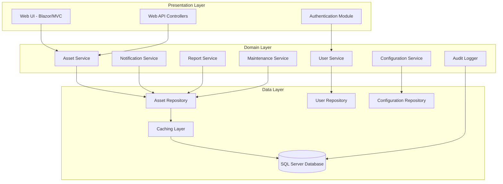

# Design Document: IT Asset Management System

## Overview

The IT Asset Management System (ITAMS) is designed as a comprehensive enterprise-level application using a layered architecture pattern with .NET Core and SQL Server. The system follows clean architecture principles with clear separation of concerns across presentation, domain, and data layers. The design emphasizes configurability, scalability, and maintainability to support complex asset management workflows across toll management and IT infrastructure environments.

The system architecture supports role-based access control with dynamic permission management, comprehensive audit logging, and configurable business rules. All system behaviors are designed to be configurable without code changes, ensuring adaptability to changing organizational requirements.

## Architecture

### High-Level Architecture

The system follows a three-layer architecture pattern based on Martin Fowler's enterprise application architecture:



### Layer Responsibilities

**Presentation Layer:**
- Handles HTTP requests and responses
- Manages user authentication and session state
- Provides web UI through Blazor Server or MVC
- Exposes REST API endpoints for external integration
- Performs input validation and output formatting

**Domain Layer:**
- Contains business logic and domain rules
- Manages asset lifecycle operations
- Enforces security and access control policies
- Coordinates cross-cutting concerns (audit, notifications)
- Maintains configuration and business rule engine

**Data Layer:**
- Manages data persistence and retrieval
- Implements repository pattern for data access
- Provides caching mechanisms for performance
- Handles database transactions and consistency
- Manages data migrations and schema evolution

## Components and Interfaces

### Core Domain Services

#### Asset Management Service
```csharp
public interface IAssetService
{
    Task<AssetDto> CreateAssetAsync(CreateAssetRequest request, UserContext user);
    Task<AssetDto> UpdateAssetAsync(Guid assetId, UpdateAssetRequest request, UserContext user);
    Task<AssetDto> GetAssetAsync(Guid assetId, UserContext user);
    Task<PagedResult<AssetDto>> SearchAssetsAsync(AssetSearchCriteria criteria, UserContext user);
    Task TransferAssetAsync(Guid assetId, TransferAssetRequest request, UserContext user);
    Task DecommissionAssetAsync(Guid assetId, DecommissionAssetRequest request, UserContext user);
    Task<List<AssetDto>> GetAssetsByLocationAsync(string location, UserContext user);
}
```

#### User Management Service
```csharp
public interface IUserService
{
    Task<UserDto> CreateUserAsync(CreateUserRequest request, UserContext creator);
    Task<UserDto> UpdateUserAsync(Guid userId, UpdateUserRequest request, UserContext updater);
    Task<bool> AuthenticateAsync(string username, string password);
    Task<UserContext> GetUserContextAsync(string username);
    Task<List<PermissionDto>> GetUserPermissionsAsync(Guid userId);
    Task UpdateUserPermissionsAsync(Guid userId, List<PermissionDto> permissions, UserContext updater);
    Task DeactivateUserAsync(Guid userId, UserContext deactivator);
}
```

#### Configuration Management Service
```csharp
public interface IConfigurationService
{
    Task<T> GetConfigurationAsync<T>(string key) where T : class;
    Task SetConfigurationAsync<T>(string key, T value, UserContext user) where T : class;
    Task<List<ConfigurationItemDto>> GetAllConfigurationsAsync(UserContext user);
    Task<BusinessRuleDto> GetBusinessRuleAsync(string ruleKey);
    Task UpdateBusinessRuleAsync(string ruleKey, BusinessRuleDto rule, UserContext user);
    Task<List<RoleDefinitionDto>> GetRoleDefinitionsAsync();
    Task UpdateRoleDefinitionAsync(RoleDefinitionDto role, UserContext user);
}
```

#### Notification Engine Service
```csharp
public interface INotificationService
{
    Task<List<NotificationDto>> GetPendingNotificationsAsync(UserContext user);
    Task SendNotificationAsync(NotificationRequest request);
    Task<List<ExpiryAlertDto>> CheckExpiringAssetsAsync();
    Task ConfigureNotificationRulesAsync(List<NotificationRuleDto> rules, UserContext user);
    Task AcknowledgeNotificationAsync(Guid notificationId, UserContext user);
    Task EscalateUnacknowledgedNotificationsAsync();
}
```

### Data Access Layer

#### Repository Interfaces
```csharp
public interface IAssetRepository
{
    Task<Asset> GetByIdAsync(Guid id);
    Task<Asset> GetByAssetTagAsync(string assetTag);
    Task<List<Asset>> SearchAsync(AssetSearchCriteria criteria);
    Task<Asset> AddAsync(Asset asset);
    Task<Asset> UpdateAsync(Asset asset);
    Task DeleteAsync(Guid id);
    Task<List<Asset>> GetExpiringAssetsAsync(DateTime thresholdDate);
    Task<List<Asset>> GetAssetsByLocationAsync(string location);
}

public interface IUserRepository
{
    Task<User> GetByIdAsync(Guid id);
    Task<User> GetByUsernameAsync(string username);
    Task<List<User>> GetAllAsync();
    Task<User> AddAsync(User user);
    Task<User> UpdateAsync(User user);
    Task<List<Permission>> GetUserPermissionsAsync(Guid userId);
    Task UpdateUserPermissionsAsync(Guid userId, List<Permission> permissions);
}

public interface IAuditRepository
{
    Task LogAsync(AuditEntry entry);
    Task<List<AuditEntry>> GetAuditTrailAsync(Guid entityId);
    Task<List<AuditEntry>> SearchAuditLogsAsync(AuditSearchCriteria criteria);
}
```

### Security and Access Control

#### Permission System
The system implements a granular permission model with configurable roles:

```csharp
public class Permission
{
    public string Resource { get; set; } // Asset, User, Report, Configuration
    public string Action { get; set; }   // Create, Read, Update, Delete, Approve
    public string Scope { get; set; }    // All, Own, Location, AssetType
    public List<string> Conditions { get; set; } // Additional constraints
}

public class RoleDefinition
{
    public string RoleName { get; set; }
    public List<Permission> Permissions { get; set; }
    public bool IsSystemRole { get; set; }
    public Dictionary<string, object> Configuration { get; set; }
}
```

#### User Context
```csharp
public class UserContext
{
    public Guid UserId { get; set; }
    public string Username { get; set; }
    public List<string> Roles { get; set; }
    public List<Permission> Permissions { get; set; }
    public string Location { get; set; }
    public Dictionary<string, object> Claims { get; set; }
}
```

## Data Models

### Core Asset Model
```csharp
public class Asset
{
    public Guid Id { get; set; }
    public string AssetId { get; set; }
    public string AssetTag { get; set; }
    public string Region { get; set; }
    public string State { get; set; }
    public string Plaza { get; set; }
    public string Location { get; set; }
    public AssetType AssetType { get; set; }
    public string SubType { get; set; }
    public string Make { get; set; }
    public string Model { get; set; }
    public string SerialNumber { get; set; }
    public UsageCategory UsageCategory { get; set; }
    public CriticalityLevel CriticalityLevel { get; set; }
    public AssetStatus Status { get; set; }
    public DateTime ProcurementDate { get; set; }
    public decimal ProcurementCost { get; set; }
    public string VendorName { get; set; }
    public DateTime? WarrantyStartDate { get; set; }
    public DateTime? WarrantyEndDate { get; set; }
    public Guid? AssignedUserId { get; set; }
    public DateTime CreatedDate { get; set; }
    public DateTime LastModifiedDate { get; set; }
    
    // Hardware-specific properties
    public HardwareSpecification HardwareSpec { get; set; }
    
    // Software-specific properties
    public SoftwareLicense SoftwareSpec { get; set; }
    
    // Navigation properties
    public List<AssetMovement> MovementHistory { get; set; }
    public List<MaintenanceRecord> MaintenanceHistory { get; set; }
    public List<ComplianceRecord> ComplianceHistory { get; set; }
}

public class HardwareSpecification
{
    public string CPU { get; set; }
    public string RAM { get; set; }
    public string Storage { get; set; }
    public string MACAddress { get; set; }
    public string IPAddress { get; set; }
    public string OperatingSystem { get; set; }
    public string Hostname { get; set; }
    public List<string> Accessories { get; set; }
}

public class SoftwareLicense
{
    public LicenseType LicenseType { get; set; }
    public string EncryptedLicenseKey { get; set; }
    public int LicensesPurchased { get; set; }
    public int LicensesConsumed { get; set; }
    public DateTime? SubscriptionStartDate { get; set; }
    public DateTime? SubscriptionEndDate { get; set; }
    public DateTime? RenewalDate { get; set; }
    public decimal RenewalCost { get; set; }
}
```

### Configuration Model
```csharp
public class ConfigurationItem
{
    public string Key { get; set; }
    public string Value { get; set; }
    public string DataType { get; set; }
    public string Category { get; set; }
    public string Description { get; set; }
    public bool IsUserConfigurable { get; set; }
    public string ValidationRules { get; set; }
    public DateTime LastModified { get; set; }
    public Guid ModifiedBy { get; set; }
}

public class BusinessRule
{
    public string RuleKey { get; set; }
    public string RuleName { get; set; }
    public string RuleExpression { get; set; }
    public bool IsActive { get; set; }
    public int Priority { get; set; }
    public Dictionary<string, object> Parameters { get; set; }
}
```

### Audit and Tracking Models
```csharp
public class AuditEntry
{
    public Guid Id { get; set; }
    public string EntityType { get; set; }
    public Guid EntityId { get; set; }
    public string Action { get; set; }
    public string Changes { get; set; }
    public Guid UserId { get; set; }
    public string Username { get; set; }
    public DateTime Timestamp { get; set; }
    public string IPAddress { get; set; }
    public string UserAgent { get; set; }
}

public class AssetMovement
{
    public Guid Id { get; set; }
    public Guid AssetId { get; set; }
    public string FromLocation { get; set; }
    public string ToLocation { get; set; }
    public MovementType MovementType { get; set; }
    public DateTime MovementDate { get; set; }
    public string Reason { get; set; }
    public Guid RequestedBy { get; set; }
    public Guid? ApprovedBy { get; set; }
    public DateTime? ApprovalDate { get; set; }
    public string Remarks { get; set; }
}
```

## Error Handling

### Exception Hierarchy
```csharp
public abstract class ITAMSException : Exception
{
    public string ErrorCode { get; }
    public Dictionary<string, object> Context { get; }
    
    protected ITAMSException(string errorCode, string message, Dictionary<string, object> context = null) 
        : base(message)
    {
        ErrorCode = errorCode;
        Context = context ?? new Dictionary<string, object>();
    }
}

public class AssetNotFoundException : ITAMSException
{
    public AssetNotFoundException(string assetId) 
        : base("ASSET_NOT_FOUND", $"Asset with ID '{assetId}' was not found")
    {
        Context["AssetId"] = assetId;
    }
}

public class InsufficientPermissionsException : ITAMSException
{
    public InsufficientPermissionsException(string resource, string action) 
        : base("INSUFFICIENT_PERMISSIONS", $"User lacks permission to {action} {resource}")
    {
        Context["Resource"] = resource;
        Context["Action"] = action;
    }
}

public class BusinessRuleViolationException : ITAMSException
{
    public BusinessRuleViolationException(string ruleName, string violation) 
        : base("BUSINESS_RULE_VIOLATION", $"Business rule '{ruleName}' violated: {violation}")
    {
        Context["RuleName"] = ruleName;
        Context["Violation"] = violation;
    }
}
```

### Global Error Handling
```csharp
public class GlobalExceptionMiddleware
{
    public async Task InvokeAsync(HttpContext context, RequestDelegate next)
    {
        try
        {
            await next(context);
        }
        catch (Exception ex)
        {
            await HandleExceptionAsync(context, ex);
        }
    }
    
    private async Task HandleExceptionAsync(HttpContext context, Exception exception)
    {
        var response = context.Response;
        response.ContentType = "application/json";
        
        var errorResponse = exception switch
        {
            ITAMSException itamsEx => new ErrorResponse
            {
                ErrorCode = itamsEx.ErrorCode,
                Message = itamsEx.Message,
                Context = itamsEx.Context,
                StatusCode = GetStatusCode(itamsEx.ErrorCode)
            },
            _ => new ErrorResponse
            {
                ErrorCode = "INTERNAL_ERROR",
                Message = "An unexpected error occurred",
                StatusCode = 500
            }
        };
        
        response.StatusCode = errorResponse.StatusCode;
        await response.WriteAsync(JsonSerializer.Serialize(errorResponse));
    }
}
```

## Testing Strategy

The testing strategy employs a dual approach combining unit tests for specific scenarios and property-based tests for universal correctness validation.

### Unit Testing Approach
- **Component Testing**: Test individual services and repositories with mocked dependencies
- **Integration Testing**: Test complete workflows across multiple layers
- **API Testing**: Validate HTTP endpoints and response formats
- **Database Testing**: Verify data access patterns and transaction handling

### Property-Based Testing Framework
The system uses **FsCheck** for .NET to implement property-based testing with minimum 100 iterations per test.

**Test Configuration:**
```csharp
[Property(Arbitrary = new[] { typeof(AssetGenerators) })]
public Property AssetCreationProperty(NonEmptyString assetTag, ValidAssetType assetType)
{
    return Prop.ForAll<CreateAssetRequest>(request =>
    {
        // Property implementation
    }).When(request => IsValidAssetRequest(request));
}
```

**Test Tagging Format:**
Each property test includes a comment with the format:
```csharp
// Feature: it-asset-management-system, Property 1: Asset registration preserves mandatory fields
```

### Testing Tools and Frameworks
- **Unit Testing**: xUnit.net with Moq for mocking
- **Property Testing**: FsCheck.NET for property-based testing
- **Integration Testing**: ASP.NET Core Test Host
- **Database Testing**: Entity Framework In-Memory provider for unit tests, SQL Server LocalDB for integration tests
- **API Testing**: WebApplicationFactory for end-to-end API testing

## Correctness Properties

*A property is a characteristic or behavior that should hold true across all valid executions of a system—essentially, a formal statement about what the system should do. Properties serve as the bridge between human-readable specifications and machine-verifiable correctness guarantees.*

Based on the prework analysis of acceptance criteria, the following properties have been identified to validate system correctness through property-based testing:

### Property 1: Asset Registration Field Preservation
*For any* valid asset registration request (hardware or software), creating the asset and then retrieving it should return all mandatory and type-specific fields with values matching the original request
**Validates: Requirements 1.1, 1.2, 1.3**

### Property 2: Asset Uniqueness Enforcement
*For any* two asset registration requests with identical Asset ID or Asset Tag values, the system should reject the second registration attempt while preserving the first
**Validates: Requirements 1.4**

### Property 3: Mandatory Classification Requirements
*For any* asset registration request missing Usage Category or Criticality Classification, the system should reject the registration and require both fields to be provided
**Validates: Requirements 2.1, 2.2, 2.3**

### Property 4: Comprehensive Audit Logging
*For any* system operation that modifies data (asset updates, classification changes, user authentication, configuration changes), an audit entry should be created containing timestamp, user identity, and change details
**Validates: Requirements 1.5, 2.4, 3.5, 7.7, 8.7, 12.7**

### Property 5: Role-Based Permission Enforcement
*For any* user attempting to perform an operation, the system should allow the operation only if the user's role includes the required permissions for that specific resource and action
**Validates: Requirements 3.1, 3.2, 3.6**

### Property 6: Configurable Password Policy Enforcement
*For any* user account creation with a password, the system should validate the password against the currently configured complexity rules and reject passwords that don't meet the requirements
**Validates: Requirements 3.3**

### Property 7: Session Management Configuration
*For any* user session, the system should enforce the configured timeout period and concurrent session limits based on the user's role
**Validates: Requirements 3.4**

### Property 8: Configurable Approval Workflow Triggering
*For any* sensitive operation, the system should trigger the configured approval workflow based on the operation type, asset criticality, and user role
**Validates: Requirements 3.7**

### Property 9: Asset Lifecycle Event Recording
*For any* asset lifecycle event (commissioning, transfer, decommissioning), the system should create a complete record with all required fields and maintain it in the asset's history
**Validates: Requirements 4.1, 4.2, 4.3, 4.4**

### Property 10: Maintenance Record Completeness
*For any* maintenance activity, the system should record all required fields (activity type, components, specifications, vendor, cost, completion date) and maintain complete history
**Validates: Requirements 5.1, 5.3, 5.5**

### Property 11: Warranty Impact Tracking
*For any* maintenance activity that affects warranty, the system should update warranty status and trigger appropriate notifications to relevant users
**Validates: Requirements 5.2**

### Property 12: Compliance Data Recording and Monitoring
*For any* compliance check performed on an asset, the system should record all compliance data (OS/DB versions, patch status, USB blocking) with verification dates and maintain historical records
**Validates: Requirements 6.1, 6.2, 6.4**

### Property 13: Compliance Violation Notification
*For any* detected compliance violation, the system should generate alerts to responsible personnel based on configured notification rules
**Validates: Requirements 6.3**

### Property 14: Policy Update Re-evaluation
*For any* compliance policy update, the system should re-evaluate all applicable assets against the new policy criteria
**Validates: Requirements 6.5**

### Property 15: Configurable Expiry Monitoring
*For any* asset with expiry dates (warranty, licenses, certificates), the system should monitor expiry based on configured thresholds and asset criticality levels
**Validates: Requirements 7.1, 7.2**

### Property 16: Multi-Channel Notification Delivery
*For any* notification trigger, the system should deliver notifications through configured channels (email, dashboard, SMS) using customizable templates and recipient lists
**Validates: Requirements 7.3, 7.4**

### Property 17: Escalation Rule Execution
*For any* unacknowledged notification, the system should execute configured escalation rules with appropriate delays and recipient chains
**Validates: Requirements 7.5**

### Property 18: Notification Timing Configuration
*For any* notification type, the system should respect configured frequency settings and quiet hours when delivering notifications
**Validates: Requirements 7.6**

### Property 19: Threshold-Based Alert Generation
*For any* monitored metric (maintenance costs, expiry dates), the system should generate alerts when configured thresholds are exceeded
**Validates: Requirements 5.4**

### Property 20: Report Generation Accuracy
*For any* report request, the generated report should contain accurate data that matches the current system state and applied filters
**Validates: Requirements 8.1, 8.2, 8.3, 8.4, 8.5, 8.6**

### Property 21: Sensitive Data Encryption
*For any* sensitive data (license keys, credentials), the system should encrypt the data when storing and decrypt when retrieving, ensuring the round-trip preserves the original value
**Validates: Requirements 9.1**

### Property 22: Data Validation and Integrity
*For any* data modification request, the system should validate data integrity and reject invalid updates while accepting valid ones
**Validates: Requirements 9.2**

### Property 23: Session Security Management
*For any* user session, the system should implement secure authentication and automatic timeout based on configured security policies
**Validates: Requirements 9.3**

### Property 24: Audit Log Integrity
*For any* audit log entry, the system should maintain tamper-evident logs that preserve integrity and cannot be modified after creation
**Validates: Requirements 9.4**

### Property 25: Database Compatibility
*For any* supported SQL Server edition (Express, Standard, Enterprise), the system should function correctly with all core features operational
**Validates: Requirements 10.4, 11.2, 11.3**

### Property 26: External System Integration
*For any* configured external integration (Active Directory, monitoring tools), the system should successfully authenticate and exchange data according to configured parameters
**Validates: Requirements 11.4, 11.5**

### Property 27: Configuration Access Control
*For any* configuration management operation, the system should allow access only to users with appropriate administrative permissions
**Validates: Requirements 12.1**

### Property 28: Business Rule Configuration and Enforcement
*For any* configurable business rule (asset classification, approval workflows, validation criteria), the system should allow configuration by authorized users and enforce the rules consistently
**Validates: Requirements 12.2, 12.4**

### Property 29: Automation Timing Configuration
*For any* automated process (maintenance schedules, compliance checks, report generation), the system should respect configured timing parameters and execute at the specified intervals
**Validates: Requirements 12.3**

### Property 30: Role-Based UI Customization
*For any* user role, the system should display dashboard layouts and report templates configured for that specific role
**Validates: Requirements 12.5**

### Property 31: Integration Endpoint Configuration
*For any* external integration endpoint, the system should allow configuration of connection parameters and data synchronization schedules
**Validates: Requirements 12.6**